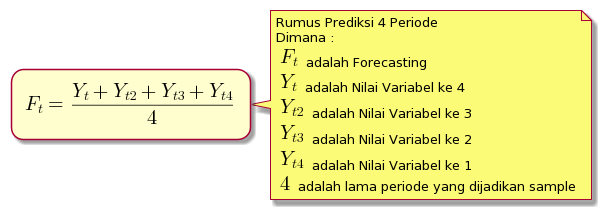

# Forecasting Model Machine Learning
### oleh
#### 8126 - Jefry Sunupurwa Asri S.Kom., M.Kom

---

# Apa itu Data ?
### adalah sekumpulan informasi yang dapat dimanfaatkan

---

# Jenis-jenis data 
- Data Kuantitatif
- Data Kualitatif
- Data Menurut Waktu
- Data Menurut Sumber

---

# Pembagian Data

---

# Apa itu Forecasting ?
### adalah salah satu metode untuk melakukan perencanaan dan pengendalian produksi untuk menghadapi ketidakpastian di masa depan. Lebih khusus untuk memprediksi permintaan produk di waktu mendatang

---

# Metode Forecasting ?
### - Kualitatif
#### dilakukan dengan berdasarkan pendapat dan analisis deskriptif
#### contoh : survey dan opini
### - Kuantitatif
#### dilakukan dengan berdasarkan hitungan matematis
#### contoh : timeseries dan casual

---

# Macam-Macam Forecasting Kuantitatif
#### - Time Series
#### Merupakan metode prediksi yang didasarkan pada data-data masa lampau suatu variabel dan atau kesalahan di masa lalu yang berurutan menurut waktu, misal hari, minggu, bulan, dan tahun.
#### - Casual
#### Merupakan motede prediksi yang berdasarkan suatu model sebab-akibat antara permintaan yang diramalkan dengan variabel-variabel lain yang dianggap berpengaruh.

---

# Contoh Rumus Forecasting Time Series

>peragaan contoh dengan file sample.csv

---

# Studi Kasus Forecasting Time Series dengan LSTM (Long Sort Term Memory)
>peragaan predict.ipynb

---

# Terima Kasih