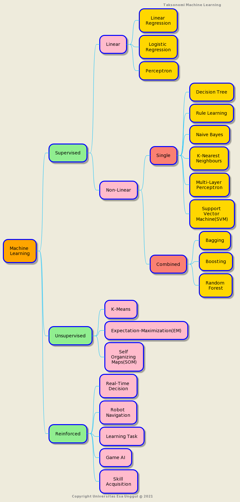
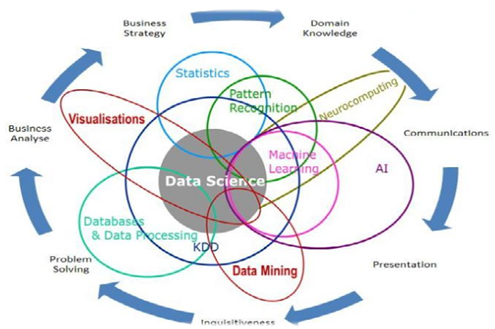
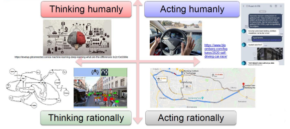
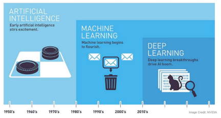

# Introduction to Machine Learning
### oleh
#### 8126 - Jefry Sunupurwa Asri S.Kom., M.Kom

---

# Apa itu Machine Learning
**Pembelajaran mesin, cabang dari kecerdasan buatan (Artificial Inteligent), adalah disiplin ilmu yang mencakup perancangan dan pengembangan algoritme yang memungkinkan komputer untuk mengembangkan perilaku berdasarkan data empiris, seperti dari sensor data basis data.**

---

# Kemampuan Teknis Yang dibutuhkan
- Pemograman Python
- Struktur Data Python
- Python Pandas
- Python Matplotlib
- Statistika Deskriptif
- Probabilitas

---

# Taksonomi Machine Learning

---

# Machine Learning dalam Artificial Inteligent 

--- 

# Definisi Artificial Inteligent
- Berpikir Rasional (Thinking Rationally)
- Bertindak Rasional (Acting Rationally)
- Berpikir Seperti Manusia (Thinking Humanly)
- Bertindak Seperti Manusia (Acting Humanly)

---

# Contoh Teknologi AI untuk setiap definisi

--- 

# Pembagian Teknologi Artificial Inteligent(Part 1)
- Berdasarkan Tujuan Task
terdapat dua jenis teknologi AI yaitu Artificial Narrow Intelligence (ANI)
dimana task yang dikerjakan adalah khusus untuk domain atau tujuan tertentu serta 
general AI yang sering juga disebut strong AI, dimana AI yang dihasilkan dapat melakukan 
berbagai hal seperti seorang manusia secara utuh. General AI memiliki tipe kecerdasan 
seperti manusia, kecerdasan yang mampu beradaptasi dan mampu melakukan tugas 
secara luas, mulai tugas yang sederhana hingga yang kompleks. Adapun contoh specific 
AI adalah chatbot untuk pemesanan tiket pesawat, klasifikasi jenis penyakit kulit, dll.

--- 

# Pembagian Teknologi Artificial Inteligent(Part 2)
- Berdasarkan Domain
Ada beberapa yakni Speech Processing, Natural Language Processing, Image Processing, dll.
Contoh speech processing aplikasi text to speech google, contoh untuk Natural Language Processing Teks Analisis, dan contoh untuk Image Processing klasifikasi gambar.

--- 

# Pembagian Teknologi Artificial Inteligent(Part 3)
- Berdasarkan Prinsip Kerja Teknologi AI
Berdasar prinsip kerja teknologi AI, AI (intelligent agent) dapat digolongkan menjadi problem solving agent dan knowledge based agent. 

--- 

# Pembagian Teknologi Artificial Inteligent(Part 4)
### Problem Solving Agent
Prinsip kerja teknologi AI pada problem solving agent adalah penggunaan algoritma searching untuk mencari solusi terbaik dari sebuah persoalan. Contoh persoalan yang dapat diselesaikan oleh problem solving agent adalah persoalan pencarian rute terpendek dari sebuah lokasi asal ke lokasi tujuan, persoalan penjadwalan kelas, persoalan pewarnaan peta, permainan catur, dll.

---

# Pembagian Teknologi Artificial Inteligent(Part 5)
### Knowledge Based Agent
Pada knowledge based agent ini, kandidat solusi tidak dapat didefinisikan dari awal atau bersifat non-deterministik. Solusi dihasilkan dari hasil penalaran terhadap knowledge yang ada. Knowledge ini dapat ditetapkan secara manual dan bisa berasal dari pakar atau juga ditetapkan secara otomatis dari data menggunakan algoritma machine learning. Contohnya sistem pakar dalam diagnosa penyakit, dll.

--- 

# Perkembangan Teknologi AI

---

# Contoh Pemanfaatan Machine Learning 
- Hasil Pencarian Search Engine
- Rekomendasi Produk Marketplace
- Pengalaman Pengguna Sosial Media
- Konten yang Ditampilkan Periklanan Digital
- Asisten Pribadi Virtual
- Fraud Detection
- Diagnosa Medis
- Mobil Kendali Otomatis

---

# Terima Kasih