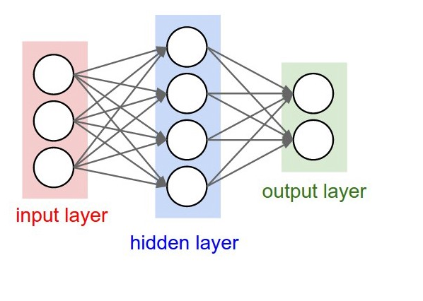
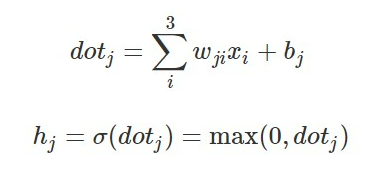

# Deep Learning
### oleh
#### 8126 - Jefry Sunupurwa Asri S.Kom., M.Kom

---

# Apa itu Deep Learning
Deep Learning adalah seperangkat algoritma dalam machine learning yang berusaha belajar dalam berbagai level sesuai tingkat abstraksi yang berbeda dan terinspirasi dari struktur otak manusia. Struktur tersebut disebut dengan jaringan saraf tiruan (neural network).

---

# Bentuk Arsitektur Deep Learning

Sehingga terdapat 3x4 weight + 4 bias dan 4x2 weight + 2 bias. Total adalah 26 parameter yang pada proses training akan mengalami perubahan untuk mendapatkan hasil yang terbaik.

---

# Penjelasan Arsitektur Deep Learning
Arsitektur diatas biasa disebut Multi Layer Perceptron (MLP) atau Fully-Connected Layer. Dimana Arsitektur pertama memiliki input layer dengan 3 buah neuron pada input layer, dan 2 buah neuron pada output layer. Dan diantara input layer dan output layer terdapat hidden layer. Setiap neuron pada MLP Saling berhubungan ditandai dengan tanda panah. Tiap koneksi memiliki weight yang nantinya nilai dari tiap weight akan berbeda-beda. 

---

# Training Neural Network
Terdapat 2 Tahap
1. Forward Pass
Forward pass atau biasa juga disebut forward propagation adalah proses dimana kita membawa data pada input melewati tiap neuron pada hidden layer sampai kepada output layer yang nanti akan dihitung errornya

Persamaan diatas adalah contoh forward pass pada arsitektur yang menggunakan ReLU sebagai activation function. Dimana i adalah node pada input layer (3 node input), j adalah node pada hidden layer sedangkan h adalah output dari node pada hidden layer.

---

# Training Neural Network (2)
2. Backward Pass
Error yang kita dapat pada forward pass akan digunakan untuk mengupdate setiap weight dan bias dengan learning rate tertentu.
Kedua proses diatas akan dilakukan berulang-ulang sampai didapatkan nilai weight dan bias yang dapat memberikan nilai error sekecil mungkin pada output layer (pada saat forward pass)

---

# CONTOH PENERAPANNYA 
- src/pendukungslide.ipynb

---

# ALGORITMA YANG BIASA DIGUNAKAN DALAM DEEP LEARNING
- CNN (Convolutional Neural Network)

- RNN (Recurrent Neural Network)

- LSTM (Long Short Term Memory Network)

---

# CNN
CNN terdiri dari banyak layer untuk memproses dan mengekstrak fitur dari data. Ia biasanya digunakan untuk memproses gambar dan mendeteksi objek. Saat ini, CNN banyak digunakan untuk mengidentifikasi citra satelit, citra medis, dan mendeteksi anomali.

---

# RNN
Recurrent Neural Networks (RNN) merupakan salah satu bentuk arsitektur Artificial Neural Networks (ANN) yang dirancang khusus untuk memproses data yang bersambung/ berurutan (sequential data). RNN biasanya digunakan untuk menyelesaikan permasalahan data historis atau time series, contohnya data ramalan cuaca. Selain itu, RNN juga dapat diimplementasikan pada bidang natural language understanding (pemahaman bahasa alami), misalnya  translasi bahasa.

---

# LSTM
LSTM merupakan tipe Recurrent Neural Network yang dapat mempelajari data historis atau time series. Ia merupakan algoritma deep learning yang kompleks dan dapat mempelajari informasi jangka panjang dengan sangat baik. LSTM sangat powerful untuk menyelesaikan berbagai permasalahan kompleks seperti speech recognition, speech to text application, komposisi musik, dan pengembangan di bidang farmasi.

---

# Manfaat Deep Learning

- Dapat memproses unstructured data seperti teks dan gambar.
- Dapat mengotomatisasi proses ekstraksi fitur tanpa perlu melakukan proses pelabelan secara manual.
- Memberikan hasil akhir yang berkualitas.
- Dapat mengurangi biaya operasional.
- Dapat melakukan manipulasi data dengan lebih efektif.

---

# Penerapan Deep Learning
- Pengenalan Gambar
- Pengenalan Suara
- NLP (Natural Language Processing)
- Deteksi Anomali

---

# Terima Kasih