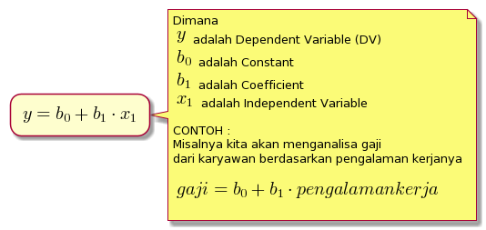
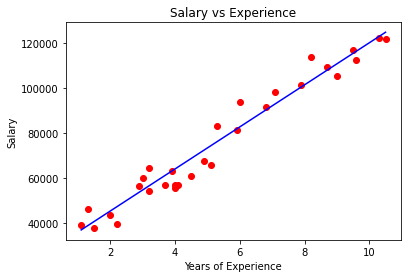
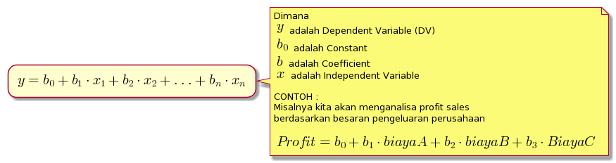
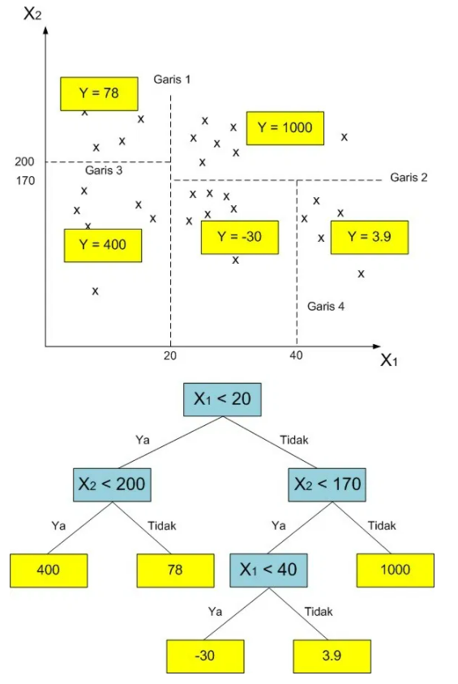

# Regresi
### oleh
#### 8126 - Jefry Sunupurwa Asri S.Kom., M.Kom

---

# Apa itu Regresi?
Regresi merupakan suatu metode yang digunakan dalam pengukuran pengaruh variabel yang bebas pada variabel tergatung. Atau bisa juga sebuah pendekatan yang digunakan untuk mendefisinkan hubungan matematis antara variabel (y) output/dependent(DV) dengan satu variabel (x) input/independent(IV)

---

# Simple Linear Regression

---

# Multiple Linear Regression

---

# Polynomial Linear Regression

---

# Support Vector Regression (SVR)

---

# Decition Tree Regression

---

# Random Forest Regression

---

# Terima Kasih

