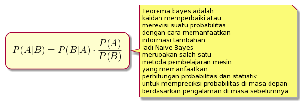

# Classification
### oleh
#### 8126 - Jefry Sunupurwa Asri S.Kom., M.Kom

---

# Apa itu Classification?
Secara matematis classification adalah tugas mendekati fungsi pemetaan (f) dari variabel input (X) ke variabel ouput (Y)

---

# Tipe Learner dalam classification
- Lazy Learners
    konsepnya adalah membuat model klasifikasi dengan menunggu data pengujian muncul setelah menyimpan data pelatihan, dan dilakukan setelah mendapat data pengujian. Contohnya : KNN
- Eager Learners
    konsepnya adalah membuat model klasifikasi tanpa menunggu data pengujian muncul setelah data pelatihan. Contohnya : DTC, Naive Bayes

---

# Decision Tree Classification
Secara umum tidak jauh berbeda dengan Decision Tree Regression karena mereka saling terikat dalam penyelesaian, biasanya Classification digunakan untuk menyelesaikan permasalahan Churn Analysis dan Risk Management Sedangkan untuk Regression nya biasa digunakan untuk menyelesaikan permasalahan metode distribusi

---

# K-Nearest Neighbors

---

# Naive Bayes

---

# Random Forest

---

# Support Vector Machine (SVM)

secara sederhana svm mencari hyperplane (batas pemisah) terbaik yang berfungsi sebagai pemisah dua buah class pada input space.

---

# Kernel SVM

---

# Terima Kasih