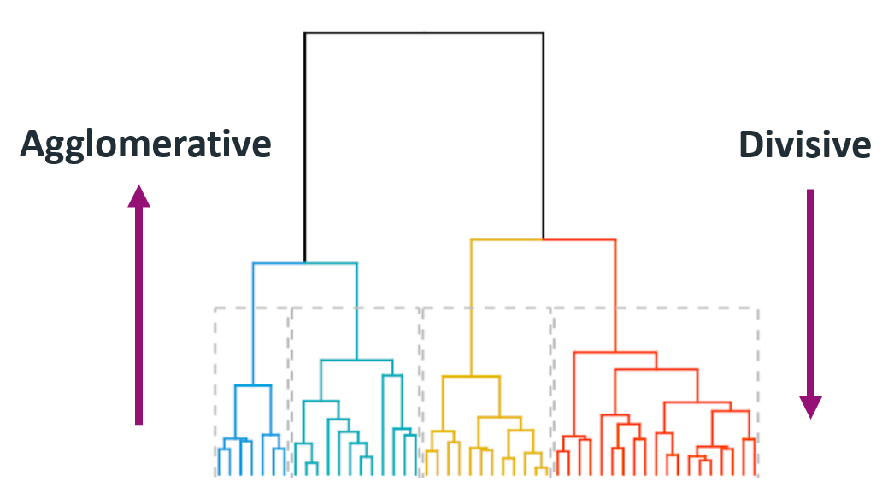
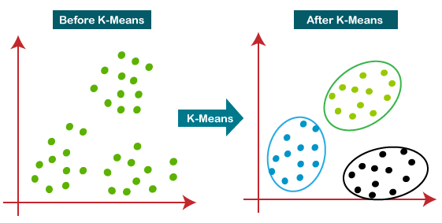

# Clustering
### oleh
#### 8126 - Jefry Sunupurwa Asri S.Kom., M.Kom

---

# Apa itu clustering?
adalah suatu teknik pengelompokan titik (data) kedalam suatu kelompok atau grup tertentu yang titik titik didalam kelompok (cluster) tersebut mempunyai kesamaan, namun berbeda dengan titik titik di cluster yang lain.

---

# Lanjutan Clustering
Simpelnya clustering adalah mengelompokkan suatu data berdasarkan variabel tertentu, misalnya ada karyawan yang ingin menyusun barang di gudang, bagaimana caranya karyawan  tersebut dapat mengelompokan dus yang sangat banyak dengan warna yang beragam? Salah satu cara yang cukup mudah yang dapat dilakukan karyawan tersebut adalah dengan mengelompokkan dus tersebut ke suatu cluster berdasarkan kemiripann warnanya.

---

# Algoritma Clustering Yang biasa di gunakan
- Hirarki
adalah teknik clustering dengan algoritma Machine Learning yang membentuk hirarki atau berdasarkan tingkatan tertentu sehingga menyerupai struktur pohon.
- K-Means
adalah mengelompokkan data yang ada ke dalam beberapa kelompok, dimana data dalam satu kelompok mempunyai karakteristik yang sama satu sama lainnya dan mempunyai karakteristik yang berbeda dengan data yang ada di dalam kelompok yang lain.

---

# Hirarki

---

# K-Means

---

# Terima Kasih