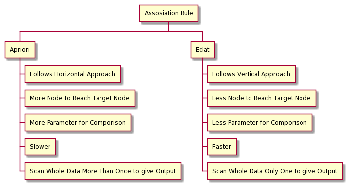

# Assosiation Rule Learning
### oleh
#### 8126 - Jefry Sunupurwa Asri S.Kom., M.Kom

---

# Apa itu Assosiation Rule Learning
merupakan salah satu metode yang dapat digunakan untuk mengindentifikasi hubungan yang menarik antara variabel dalam suatu data

---

# Algoritma Popular dalam Assosiation Rule
- Apriori
adalah teknik dalam menganalisa banyaknya kombinasi produk yang terjadi di dalam transaksi ritel, yang akan sulit dan lama jika dilakukan secara manual. Secara teknis, metode analisis data ini akan mencari tingkat asosiasi antar item di dalam banyak kombinasi kelompok data secara otomatis.
- Eclat
adalah versi sederhana dari apriori 

---

# Perbedaan Mendasar Antara Apriori dan Eclat

---

# Terima Kasih
